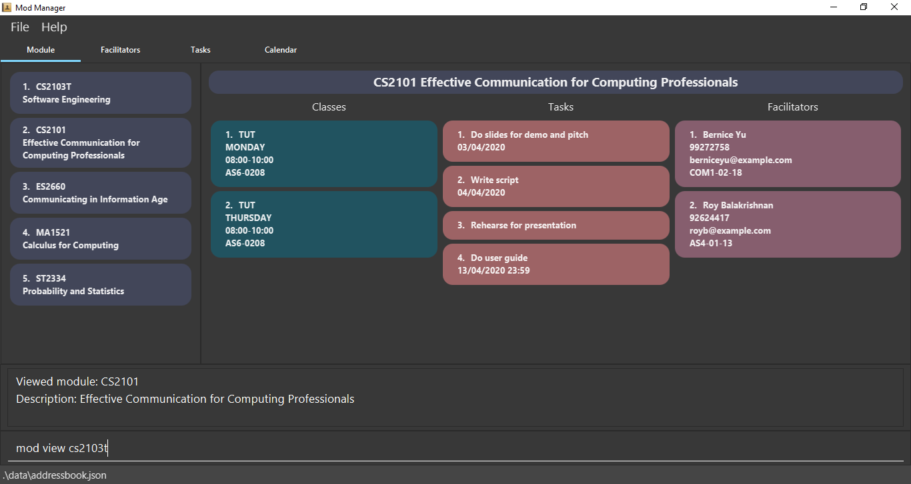

= Mod Manager
ifdef::env-github,env-browser[:relfileprefix: docs/]

https://travis-ci.org/AY1920S2-CS2103T-F10-4/main[image:https://travis-ci.org/AY1920S2-CS2103T-F10-4/main.svg?branch=master[Build Status]]
https://ci.appveyor.com/project/zixinn/main[image:https://ci.appveyor.com/api/projects/status/cnab1lf37p7ih8tt?svg=true[Build status]]
https://coveralls.io/github/AY1920S2-CS2103T-F10-4/main?branch=master[image:https://coveralls.io/repos/github/AY1920S2-CS2103T-F10-4/main/badge.svg?branch=master[Coverage Status]]
https://www.codacy.com/gh/AY1920S2-CS2103T-F10-4/main?utm_source=github.com&utm_medium=referral&utm_content=AY1920S2-CS2103T-F10-4/main&utm_campaign=Badge_Grade[image:https://api.codacy.com/project/badge/Grade/d8b25ce708264de48d4fe0c81996fed3[Codacy Badge]]

ifdef::env-github[]

endif::[]

ifndef::env-github[]
image::images/Ui.png[width="600"]
endif::[]

// Marketing blurb
== About Mod Manager

The best module manager made for *NUS students* who love to type and prefer to use a desktop application for managing modules in a semester.

****
*Special Features*:

////
* Save important content from a webpage for *offline* use, and *annotate* it right away.
* Set *reminders* for websites. Never forget to pay those pesky e-bills again!
* Sort and tag your bookmarks automatically with our intelligent *auto-tagging* system. Keeping your bookmarks organized is easy.
////
* It can get your management of modules done faster than traditional GUI apps, if you can type fast.
****

****
*Target User*:

* NUS students
****

== Site Map

* <<UserGuide#, User Guide>>
* <<DeveloperGuide#, Developer Guide>>
* <<AboutUs#, About Us>>
* <<ContactUs#, Contact Us>>

== Acknowledgements

* Mod Manager was adapted from AddressBook-Level3 project created by SE-EDU initiative at https://se-education.org
* Some parts of this sample application were inspired by the excellent http://code.makery.ch/library/javafx-8-tutorial/[Java FX tutorial] by
_Marco Jakob_.
* Libraries used: https://openjfx.io/[JavaFX], https://github.com/FasterXML/jackson[Jackson], https://github.com/junit-team/junit5[JUnit5]

== Licence : link:LICENSE[MIT]
